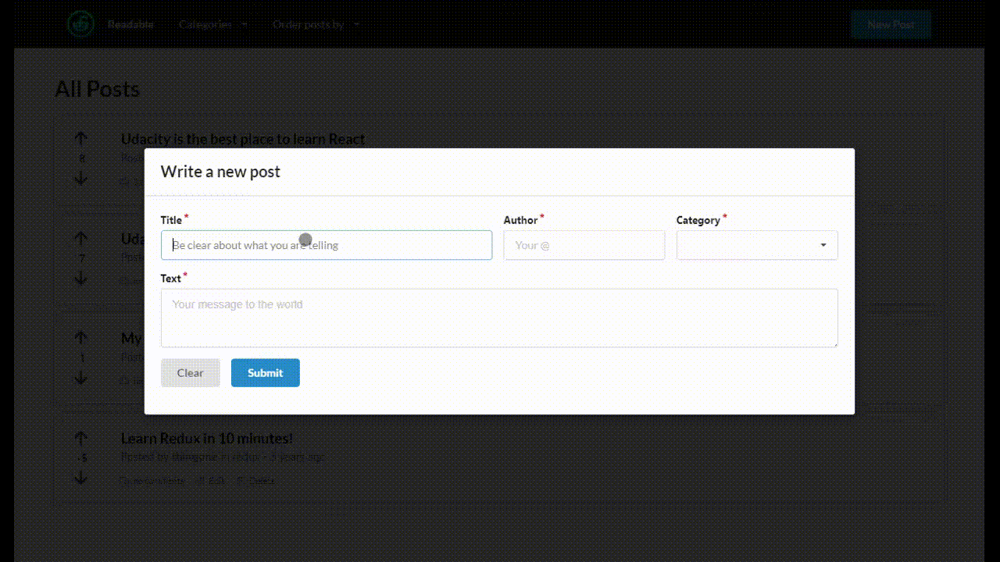

# Readable WebApp

This is my second project for Udacity's React Nanodegree. The aim of the project is to build a content and comment web app. Users are able to post content to predefined categories, comment on their posts and other users' posts, and vote on posts and comments. Users also are be able to edit and delete posts and comments.

This repository includes code for the backend API Server provided by Udacity and the front-end portion of the project.

## Screenshot

## Libraries Used

- [Semantic UI](https://react.semantic-ui.com/)
- [react-time-ago](https://www.npmjs.com/package/react-time-ago)
- React Redux, Redux Thunk, PropTypes and well-known react stuff

## Attribution

The following icons from [Freepik](https://www.freepik.com/) under [Creative Commons BY 3.0](http://creativecommons.org/licenses/by/3.0/) are used by this project:

- [Reddit](https://www.flaticon.com/free-icon/reddit_1384077)

## Code Style

The project aims to follow Airbnb React/JS styling guide. The exceptions are jsx instead js extensions, due to Udacity review system supporting only the js extension; and the usage of forbid prop types (in special object generics), because the project does not use typescript and has no definitions for model classes.

## Run Project

To get started developing right away:

* Install and start the API server
    - `cd api-server`
    - `npm install`
    - `node server`
* Install and start the Frontend client
    - `cd frontend`
    - `npm install`
    - `npm start`

## API Server

Information about the API server and how to use it can be found in its [README file](api-server/README.md).
